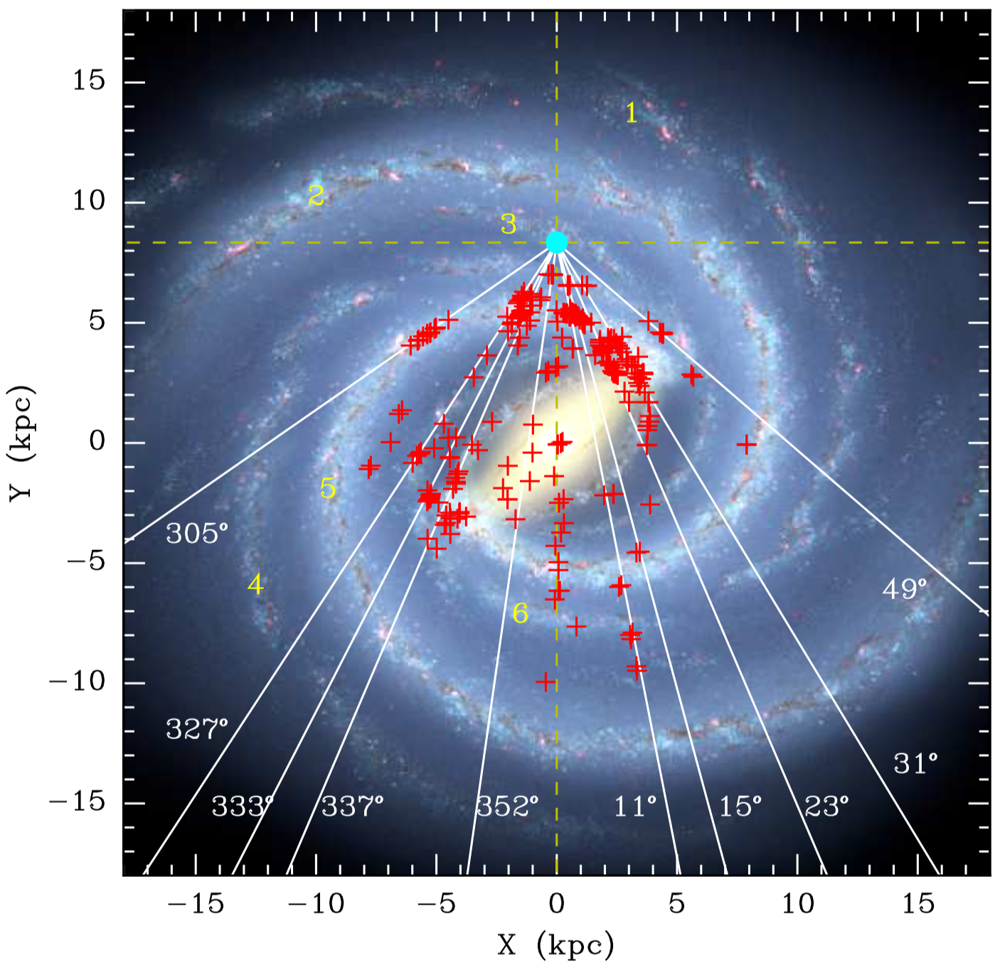

# Top-down schematic of the Miky_Way

This repository contains python scripts for plotting sources on the top-down schematic of the Milky Way.
The resultant plot is shown as follows.

{: style="width: 60%"}
**Caption** Figure Top-down schematic of the Milky Way (artist’s concept, R. Hurt: NASA/JPL- Caltech/SSC). 
The spiral arms are indicated using numbers from 1 to 6, re- ferring to the Outer, Perseus, Local, 
Carina-Sagittarius, Scutum-Centaurus, and Norma arms.
